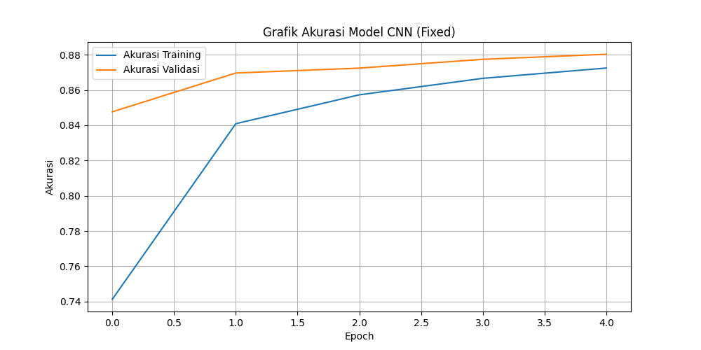

# ✍️ Handwriting Recognition using CNN (EMNIST)

An interactive deep learning application to recognize handwritten characters, built during my 5th semester at **Universitas Pamulang**.

## 🚀 Overview
This project implements a **Convolutional Neural Network (CNN)** to classify 47 classes of handwritten characters (letters and digits) using the **EMNIST Balanced** dataset. The application features a real-time drawing canvas for instant inference.

## 🛠️ Tech Stack & Environment
- **Operating System:** Linux Mint 22
- **Processor:** Optimized for AMD A9-9425
- **Language:** Python 3.12
- **Frameworks:** TensorFlow, Keras, OpenCV, Streamlit

## 📊 Performance
- **Training Epochs:** 10
- **Accuracy:** >80% on validation set
- **Hardware Optimization:** Adjusted batch sizes to run smoothly on dual-core processors.



## 💻 Installation
1. Clone the repo:
   ```bash
   git clone [https://github.com/DavaRay13/handwriting-cnn-pcd.git](https://github.com/DavaRay13/handwriting-cnn-pcd.git)